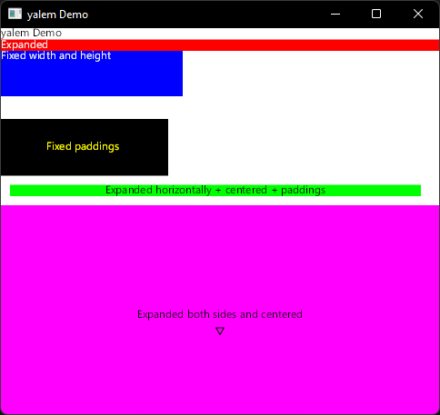
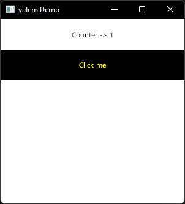

# yalem ✨ - Experimental UI Library for Rust

> Note: I made this in just a couple of days so, don't expect high quality code <3. I don't think this will come out as something usable, I am not **that** experienced making this kind of libraries.

This is an **experimental** (⚠️⚠️⚠️) attempt to build a UI library for Rust, based on [Skia](https://github.com/rust-skia/rust-skia/). It's inspired by Flutter and React.

Supported Widgets:
- Button
- Center
- Expand
- List
- Padding
- Stateful
- Text

### Examples

